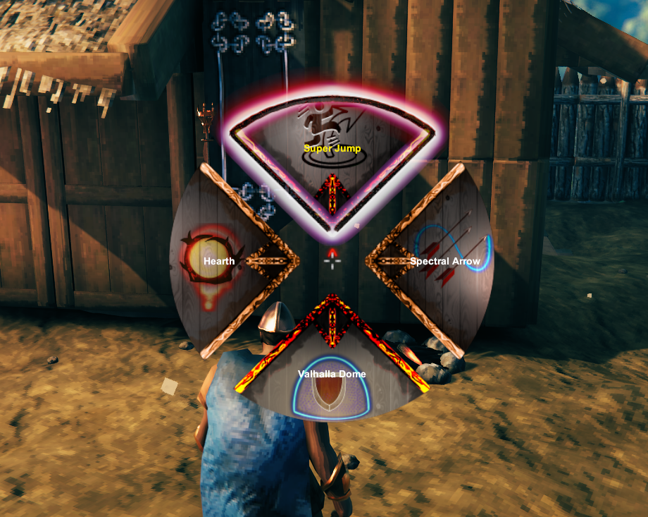

# Odin's Gift

**A custom ability mod for Valheim with full keyboard and controller support.**

---

## ⚠️ Disclaimer

**This mod is provided as-is. Use at your own risk!**

- This mod modifies core gameplay and may cause bugs, crashes, or unexpected behavior.
- Always back up your saves before installing.
- Not officially supported by Iron Gate or Valheim developers.

---

## Features

- Adds new special abilities to your character
- Fully supports both keyboard and gamepad/controller
- Radial menu for quick ability selection (default: `H` or D-Pad Down)
- Each ability has unique effects, cooldowns, and visuals
- Custom status effects and VFX

---

## Multiplayer & Compatibility

- This mod is fully client-side: **only players who want to use the abilities need to install it.**
- Not every player on a server needs the mod for everyone to play together.
- This allows for cross-platform play and does not require server-side installation.

---

## Abilities

### 🦘 Super Jump
- **Leap high into the air with a gust of wind.**
- **How to use:** Select via radial menu, then press Jump (`Space`/`A` on controller) to activate.
- **Cooldown:** Moderate
- 

### 🏠 Teleport Home
- **Teleport instantly to your bed/home.**
- **How to use:** Select via radial menu, confirm, and wait for countdown. Cancels if interrupted.
- **Cooldown:** Once per in-game day
- 

### 🏹 Spectral Arrow
- **Your next 3 bow shots become spectral arrows.**
- **How to use:** Select via radial menu, then use any bow. HUD shows remaining shots.
- **Cooldown:** Long
- 

### 🛡️ Valhalla Dome
- **Summon a protective dome at your location.**
- **How to use:** Select via radial menu, confirm to deploy.
- **Cooldown:** Long
- 

---

## Controls & Mapping

- **Open Ability Menu:** `H` (keyboard) or D-Pad Down (controller)
- **Navigate/Select:** Mouse or right stick
- **Close Menu:** `E` (keyboard) or `B/Circle` (controller)

---

## Customizing Button Mappings

You can change the default key and controller button for the ability menu:

1. After running the mod once, open the generated `valheimmod.cfg` file in your `BepInEx/config` folder.
2. Look for these entries:
  - `SpecialRadialKey` (keyboard, default: `H`)
  - `SpecialRadialKey Gamepad` (controller, default: `DPadDown`)
  - `SpecialRadialKeyClose` (controller, default: `ButtonEast`)
3. Change the values to your preferred keys/buttons. Save the file and restart the game.

**Warning:**
- Avoid mapping the ability menu to keys/buttons already used by Valheim (such as `E` for interact, or D-Pad Down for Guardian Power) to prevent conflicts.
- If you experience issues with abilities not triggering or menus not opening, try different mappings.

For a full list of valid button names, see the BepInEx or Jötunn documentation.

---

## Screenshots

  
  
  
  
  

*Example of the radial ability menu UI:*

---

## Jotunn

This mod is built using [Jötunn](https://github.com/Valheim-Modding/Jotunn) and BepInEx. For modding help, see the [Jötunn Docs](https://valheim-modding.github.io/Jotunn/guides/overview.html).

---

## Installation

1. Install [BepInExPack for Valheim](https://valheim.thunderstore.io/package/denikson/BepInExPack_Valheim/)
2. Download this mod and extract to your `BepInEx/plugins` folder
3. Launch the game

---

## Support & Issues
## Known Issues

- **Valhalla Dome in Multiplayer:**
  - If the player who summoned the dome dies, the dome may disappear prematurely for all players.
  - If the player disconnects or logs out, the dome may revert to a standard shield generator object.
  - These are network synchronization issues and may be improved in future updates.

- This is an experimental mod. Report issues on the mod page or GitHub if available.
- Not affiliated with Iron Gate or official Valheim modding.
